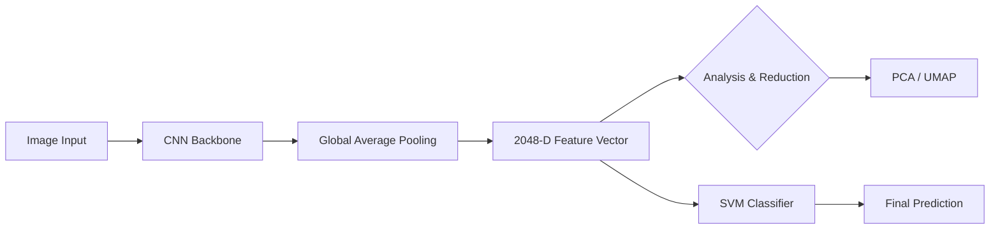

# 🚦 Phân loại Biển báo Giao thông (GTSRB Classification)

## Deep Feature Manifolds & Hybrid SVM Optimization

Báo cáo dự án cuối kỳ môn **Machine Learning and Data Mining II** tại Trường Đại học Khoa học và Công nghệ Hà Nội (USTH). Dự án tập trung vào việc xây dựng một hệ thống nhận diện biển báo giao thông vững chắc bằng cách kết hợp sức mạnh của Học sâu (Deep Learning) và các máy vector hỗ trợ (SVM).

---

## 🏆 Thành tựu Nổi bật (Key Highlights)

- **Độ chính xác đỉnh cao (Peak Accuracy):** Đạt **97.24%** với mô hình Hybrid **InceptionV3 - RBF SVM**.
- **Phân tích Đa chiều:** Sử dụng kỹ thuật giảm chiều phi tuyến **UMAP 3D** để trực quan hóa không gian đặc trưng.
- **Kiến trúc Modular Monolith:** Hệ thống được thiết kế theo module hóa, tách biệt logic trích xuất, huấn luyện và báo cáo.
- **Báo cáo chuyên nghiệp:** Tài liệu báo cáo chi tiết dày 22 trang định dạng LaTeX.

---

## 🧬 Phương pháp luận (Methodology)

Dự án áp dụng quy trình trích xuất đặc trưng tự động (Automated Feature Extraction) thay thế cho Feature Engineering thủ công kiểu cũ:



### 1. Feature Extractors

- **ResNet50:** Tận dụng Residual Learning (Skip-connections) để giảm thiểu mất mát gradient.
- **InceptionV3:** Sử dụng đa quy mô (Multi-scale) với các module Factorized Convolutions.

### 2. Dimensionality Reduction

- **PCA (Tuyến tính):** Đánh giá mật độ thông tin toàn cục.
- **UMAP (Phi tuyến):** Bảo tồn cấu trúc láng giềng cục bộ trong không gian 3D.

---

## 🌐 Trực quan hóa Tương tác (Interactive 3D Visualizations)

Điểm đặc biệt của dự án là khả năng quan sát dữ liệu trong không gian 3D. Bạn có thể mở các tệp sau để trải nghiệm:

- 🧊 [ResNet50 3D Manifold](reports/interactive/umap_3d_resnet50.html)
- 🧊 [InceptionV3 3D Manifold](reports/interactive/umap_3d_inceptionv3.html)
- 🧊 [So sánh PCA vs UMAP](reports/interactive/compare_3d_pca.html)

---

## 🏗️ Cấu trúc Thư mục (Project Organization)

```text
.
├── src/                # Logic cốt lõi (Extractors, Data Loaders)
├── scripts/            # Kịch bản thực thi (Trích xuất, Huấn luyện, Vẽ biểu đồ)
├── data/               # Dữ liệu ảnh thô và Đặc trưng đã lưu
├── docs/               # Tài liệu chi tiết về chiến lược và phân tích
├── reports/            # Kết quả đầu ra (Biểu đồ PNG, Trace CSV, Interactive HTML)
├── report/             # Toàn bộ mã nguồn LaTeX của báo cáo
└── main.pdf           # Báo cáo cuối cùng (Final Report)
```

---

## 🛠️ Hướng dẫn Cài đặt & Sử dụng

Hệ thống được tối ưu hóa cho quản lý gói bằng **uv**.

### Khởi tạo môi trường

```bash
uv venv && source .venv/bin/activate
uv pip install torch torchvision pandas scikit-learn umap-learn matplotlib seaborn
```

### Chạy quy trình Pipeline Toàn diện (Full Pipeline)

Dự án được thiết kế theo các giai đoạn tuần tự để đảm bảo tính minh bạch và khả năng tái lập kết quả.

#### Giai đoạn 1: Chuẩn bị & EDA

Khám phá dữ liệu và tạo các tài nguyên minh họa cho báo cáo:

```bash
# Vẽ biểu đồ phân phối lớp (Class Distribution)
uv run scripts/plot_class_distribution.py

# Tạo lưới ảnh minh họa mẫu dữ liệu (Dataset Samples)
uv run scripts/generate_dataset_samples.py
uv run scripts/generate_meta_grid.py
```

#### Giai đoạn 2: Trích xuất Đặc trưng (Deep Feature Extraction)

Sử dụng các Backbone mạnh mẽ để chuyển đổi ảnh thô thành vector đặc trưng 2048-D:

```bash
# Trích xuất với ResNet50 (Phát hiện phần cứng MPS/CUDA tự động)
uv run scripts/run_resnet.py

# Trích xuất với InceptionV3
uv run scripts/run_inception.py
```

#### Giai đoạn 3: Phân tích Đối chứng (Ablation Study)

So sánh năng lực biểu diễn của các kiến trúc thông qua không gian giảm chiều:

```bash
# So sánh phương sai tích lũy PCA (Thông tin nén)
uv run scripts/compare_pca_variance.py

# Tính toán các chỉ số phân cụm định lượng (Silhouette, DB Index)
uv run scripts/calculate_cluster_metrics.py

# Trực quan hóa 3D tương tác (HTML)
uv run scripts/compare_pca_umap_3d.py
```

#### Giai đoạn 4: Huấn luyện & Đánh giá (Training & Evaluation)

Thực thi các cấu hình SVM khác nhau và đánh giá hiệu năng chi tiết trên tập kiểm thử:

**1. Huấn luyện (Training):**

```bash
# Huấn luyện Linear SVM bằng SGD (Giải pháp "tốc độ" - Baseline)
uv run scripts/train_model.py

# Huấn luyện Non-linear SVM với RBF Kernel (Kết quả tối ưu)
uv run scripts/train_final_svm.py
```

**2. Đánh giá chi tiết (Evaluation):**

```bash
# Đánh giá Baseline (Linear SGD): Xuất Report & Confusion Matrix
uv run scripts/evaluate_model.py

# Đánh giá RBF SVM: Xuất Bảng tổng hợp & Confusion Matrix nhiệt (Red map)
uv run scripts/evaluate_rbf_svm.py

# Phân tích sâu mẫu dự báo sai (Failure Analysis)
uv run scripts/extract_misclassified_samples.py
uv run scripts/visualize_misclassified.py
```

---

## 📄 Tài liệu Dự án

- **Báo cáo chi tiết:** [report/main.pdf](report/main.pdf)
- **Phân tích đối chứng:** [docs/ABLATION_STUDY_ANALYSIS.md](docs/ABLATION_STUDY_ANALYSIS.md)
- **Tài liệu tham khảo (References):** Chứa các nghiên cứu tiêu biểu của Stallkamp (GTSRB), Zaklouta (SVM) và He (ResNet).

---

## 🛠️ Quy trình Làm việc Nhóm (Git Workflow)

Để đảm bảo code không bị xung đột và dễ dàng quản lý, yêu cầu tất cả thành viên tuân thủ quy trình sau:

### 1. Cập nhật mã nguồn mới nhất

Trước khi bắt đầu làm việc, luôn cập nhật code từ nhánh chính:

```bash
git checkout main
git pull origin main
```

### 2. Tạo nhánh tính năng mới (Feature Branch)

Không bao giờ code trực tiếp trên nhánh `main`. Hãy tạo nhánh mới với tiền tố `feature/`:

```bash
# Cấu trúc: feature/[tên-thành-viên]-[tên-tính-năng]
git checkout -b feature/toan-update-readme
```

### 3. Commit và Push

Nên commit thường xuyên với nội dung rõ ràng:

```bash
git add .
git commit -m "feat: mô tả ngắn gọn tính năng vừa làm"
git push origin feature/tên-nhánh-của-bạn
```

### 4. Tạo Pull Request (PR)

Sau khi hoàn thành, tạo PR trên GitHub để Leader review code trước khi merge vào `main`.

---

## 👥 Đội ngũ Thực hiện (Team Members)

- **Đỗ Duy Toàn (22BI13420)** - *Team Leader & AI Researcher*
- Vũ Tùng Lâm (22BI13241)
- Nguyễn Thái An (22BI13005)
- Nguyễn Văn Linh (22BI13252)
- Phạm Viết Hải Đăng (22BI13074)
- Tạ Hiếu Nam (22BI13327)

**Giảng viên hướng dẫn:** TS. Đoàn Nhật Quang
