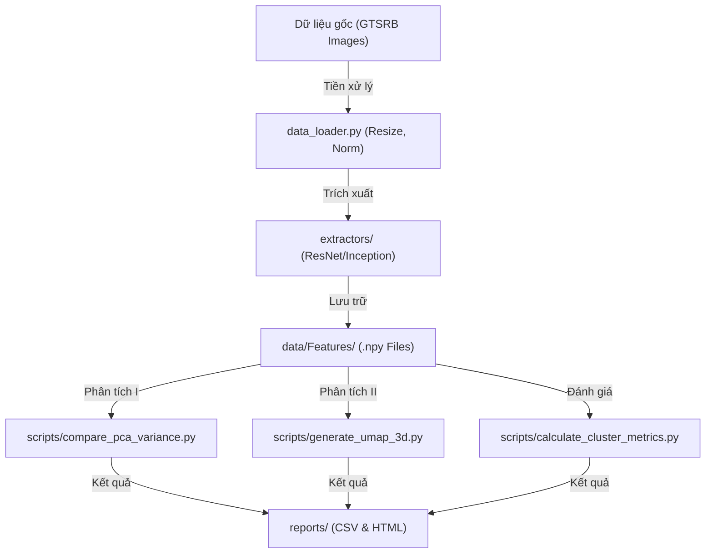

# Hướng dẫn Khai thác & Giải thích Pipeline Kỹ thuật

Tài liệu này giúp bạn kết nối các kiến thức đã học trong Lab với quy trình thực tế của dự án, đồng thời giải mã các tệp dữ liệu báo cáo.

---

## 1. Sơ đồ Luồng dữ liệu (Data Pipeline Architecture)

Để bạn không bị "rối", hãy nhìn quy trình này như một dây chuyền sản xuất gồm 4 công đoạn chính. Cấu trúc này tuân thủ mô hình **Modular Monolith**, giúp code sạch và dễ quản lý hơn các file lab đơn lẻ:

**Tại sao lại khác bài Lab?**
- **Trong Lab:** Bạn thường viết tất cả vào một file `.ipynb`.
- **Thực tế:** Chúng ta chia nhỏ ra để khi bạn muốn đổi model (ví dụ từ ResNet sang VGG), bạn chỉ cần thay đổi "mô-đun" trích xuất mà không phải sửa lại code vẽ đồ thị hay code tính toán.

---

## 2. Giải mã tệp dữ liệu `pca_variance_trace.csv`

File này chứa "linh hồn" của phân tích PCA. Dưới đây là ý nghĩa chi tiết từng cột để bạn báo cáo:

| Tên cột | Ý nghĩa Kỹ thuật | Giải thích bình dân |
| :--- | :--- | :--- |
| **n_components** | Thứ tự của Thành phần chính | Xếp hạng "độ quan trọng" từ 1 đến 200. |
| **individual** | Explained Variance Ratio | **Lượng thông tin riêng lẻ** mà một trục đó gánh vác. |
| **cumulative** | Cumulative Variance Ratio | **Tổng thông tin tích lũy** (Bằng tổng các dòng individual phía trên cộng lại). |

### 4.1. Cột `individual` thực sự nghĩa là gì?
Hãy tưởng tượng dữ liệu 2048 chiều là một căn phòng đầy đồ đạc.
- **Dòng 1 (PC1):** Bạn đặt một cái đèn pin ở góc tốt nhất, ánh sáng chiếu ra làm nổi bật **20.49%** (individual) đồ đạc trong phòng.
- **Dòng 2 (PC2):** Bạn đặt thêm một cái đèn pin thứ hai ở góc khác. Cái đèn này soi thêm được **6.91%** (individual) đồ đạc mà cái đèn thứ nhất chưa soi tới.
- **Cumulative lúc này:** 20.49% + 6.91% = **27.4%** (Tổng lượng đồ đạc bạn đã thấy được).

---

## 5. Làm sao PCA biết đâu là "Thành phần chính"?

Đây là phần "ma thuật" toán học bên dưới thư viện `scikit-learn`:

1.  **Tìm trục có phương sai lớn nhất:** PCA quét qua không gian 2048 chiều và tìm một hướng (vector) mà ở đó dữ liệu "trải dài" nhất. Hướng này có sức chứa thông tin lớn nhất, được đặt tên là **PC1**.
2.  **Tính vuông góc (Orthogonality):** Sau khi tìm xong PC1, PCA tìm hướng tiếp theo **vuông góc** với PC1 mà vẫn giữ được nhiều thông tin còn lại nhất. Đó là **PC2**.
3.  **Xếp hạng theo Eigenvalues:** Trong toán học, mỗi PC đi kèm với một con số gọi là `Eigenvalue` (Trị riêng).
    - Eigenvalue càng lớn -> Trục đó càng "chính".
    - PCA tự động sắp xếp các trục theo thứ tự Eigenvalue từ lớn đến bé. Đó là lý do PC1 luôn "xịn" hơn PC2.

> [!IMPORTANT]
> **Kết luận:** PCA không "đoán" đại, nó dùng toán học để xoay các trục tọa độ sao cho những trục đầu tiên (Principal Components) hốt được nhiều "topping" (phương sai) nhất có thể.

---

## 3. Bản đồ giảm chiều (Dimension Map)

Dưới đây là bảng tra cứu nhanh để bạn biết mình đang làm việc trên bao nhiêu chiều ở mỗi bước:

| Công đoạn | Đầu vào (Input) | Đầu ra (Output) | Mục đích |
| :--- | :--- | :--- | :--- |
| **Trích xuất** | Ảnh (224x224x3) | **2,048 chiều** | Tạo vector đặc trưng số học. |
| **PCA** | 2,048 chiều | **200 chiều** | Đánh giá khả năng nén thông tin. |
| **Metrics (S-Score)**| **2,048 chiều** | 1 con số | Đánh giá độ tách cụm khách quan nhất. |
| **UMAP** | 2,048 chiều | **3 chiều** | Vẽ biểu đồ 3D để mắt người nhìn được. |

---

## 4. Góc chuyên gia: Components vs Features

Đây là câu hỏi rất hay mà các thầy cô thường dùng để "vặn" sinh viên. Bạn hãy nắm chắc các ý sau:

### 4.1. 200 Components có phải là 200 Features không?
**KHÔNG.** 
- **Features gốc:** Là 2,048 con số "thô" xuất ra từ mạng ResNet/Inception. Mỗi con số đại diện cho một đặc điểm hình ảnh (góc cạnh, màu sắc...) mà mạng học được.
- **PCA Components:** Là 200 "siêu đặc trưng" được tạo ra bằng cách kết hợp tuyến tính từ 2,048 chiều gốc. Nghĩa là 1 Component chứa đựng thông tin của rất nhiều Feature gốc gộp lại.

### 4.2. Tại sao lại chọn con số 200?
Tại sao không phải 100 hay 500? Có 3 lý do chính:
1. **Luật 90% (Heuristic):** Trong Deep Learning, thông tin quan trọng thường tập trung ở những chiều đầu tiên. Với 200 chiều, chúng ta thường đã bắt được hơn **80-90% "linh hồn"** của 2,048 chiều gốc.
2. **Quan sát Scree Plot (Độ dốc):** Biểu đồ PCA thường "gãy" và đi ngang (flatten) sau khoảng 100-150 chiều. Chọn 200 giúp chúng ta nhìn thấy rõ cái "đuôi" biểu đồ đã thực sự bão hòa.
3. **Hiệu năng:** 200 là con số đủ lớn để so sánh sự khác biệt giữa các mô hình, nhưng đủ nhỏ để máy tính toán và vẽ đồ thị trong vài giây.

> [!IMPORTANT]
> **Điểm mấu chốt:** Việc ResNet đạt độ dốc cao hơn ở 200 chiều này chứng tỏ nó gom thông tin vào các "siêu đặc trưng" hiệu quả hơn Inception.
> [!TIP]
> Nếu các thầy hỏi: "Tại sao không tính Silhouette Score trên UMAP?", bạn hãy trả lời: "Vì UMAP đã làm biến dạng khoảng cách để tách cụm, nên tính trên 2048 chiều gốc mới phản ánh đúng năng lực thực sự của mạng CNN".
