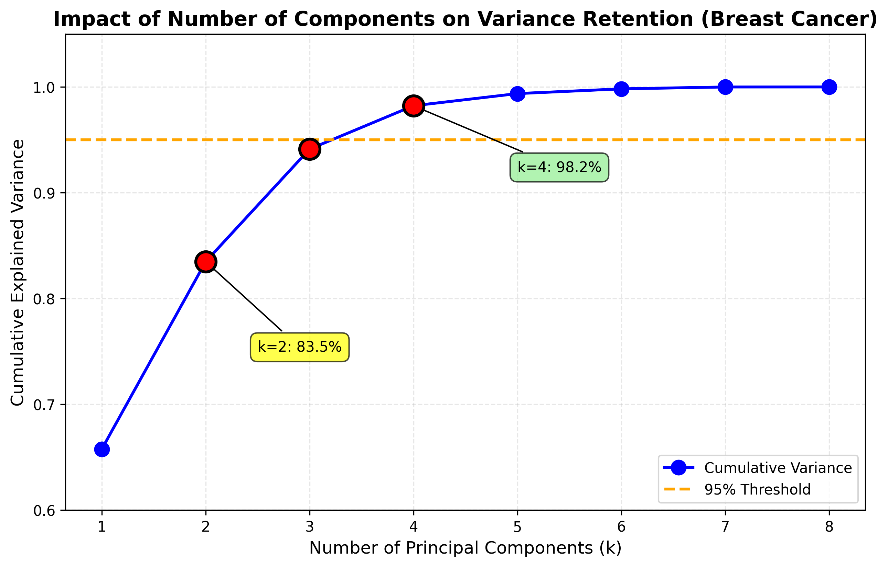

# 2.2 Varying the number of used Principal Components

*Scope: Analysis performed on the **first 10 dimensions** (8 numeric features).*

We analyzed the effect of varying the number of Principal Components ($k$) on the preserved information.

## Analysis of Results

| Number of PCs ($k$) | Cumulative Variance | Information Loss | Comment |
| :---: | :---: | :---: | :--- |
| **2** | **83.5%** | Moderate (~16%) | **Use Case: Visualization.** With just 2 dimensions, we capture a massive 83.5% of the variance. This suggests the data (in this subset) is highly correlated and 2D plotting is very effective. |
| **3** | **94.1%** | Low (~6%) | **Use Case: Fast Training.** Explained variance jumps to 94%. We can almost accurately reconstruct the dataset with just 3 numbers per patient. |
| **4** | **98.2%** | **Minimal (~1.8%)** | **Use Case: Optimal Model.** This passes the 95% threshold. Reducing from 8 original features to 4 components effectively halves the dataset size with negligible loss. |
| **8** | **100.0%** | None (0%) | **Redundant.** The last 4 components contribute < 2% of information combined. Keeping them adds noise and computation cost without benefit. |

*Figure: Impact of varying the number of principal components on cumulative explained variance. The optimal choice (k=4) achieves 98.2% variance while reducing dimensionality by 50%. The steep initial rise demonstrates high data redundancy in the original features.*

## Conclusion and Feasibility Check

**Question**: *With only these 8 features (Mean values), is it still possible to train a model to predict the Malignant/Benign labels?*

**ANSWER: YES, ABSOLUTELY.**

1.  **High Signal Content**: Even with just these 8 features, our PCA shows that they contain significant, structured variability (Outcome: 83% variance in just 2D). This implies strong patterns exist.
2.  **Core Features**: These 8 features represent the **Mean** values (Radius, Texture, Area, etc.). In medical imaging, the "Mean" (average size/texture) is the most predictive signal.
3.  **Vs. Full Dataset**: The remaining features in the full dataset (Standard Error and Worst/Largest) provide *additional* details about tumor irregularity and outliers.
    *   **Is it better with all 30?** Likely yes, by a small margin (e.g., 97% accuracy vs 94%).
    *   **Is 8 enough?** Yes, 8 features are sufficient to build a **very strong baseline model** (likely >90% accuracy). You do **not** "strictly need" the others to train a working classifier.