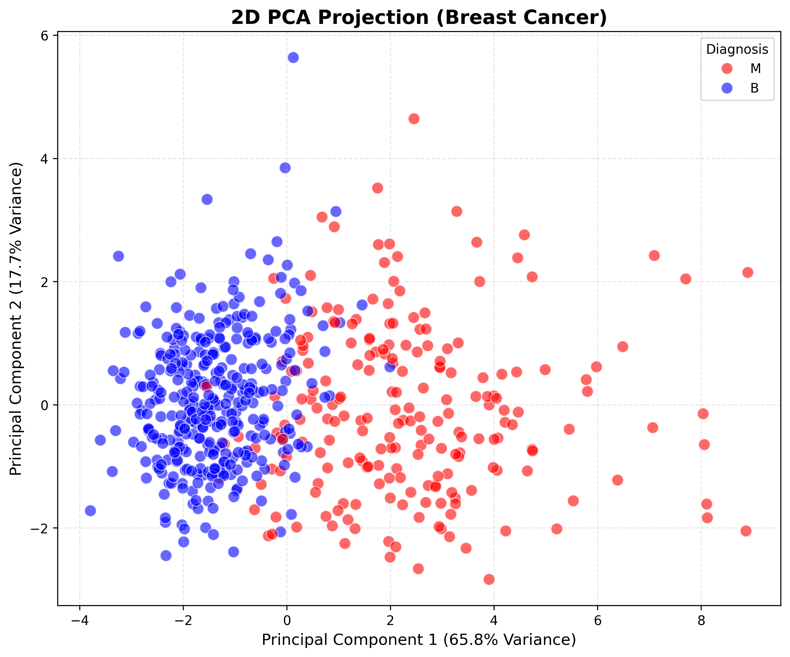

# 2.3 Data Distribution Visualization (2D PCA)

*Scope: First 10 Dimensions (8 Numeric Features).*

We projected the 8-dimensional feature space onto a 2D plane using the first two Principal Components, which collectively explain **83.5%** of the total variance.

*Figure: 2D PCA projection of Breast Cancer dataset. Blue points represent Benign tumors, red points represent Malignant tumors. PC1 (65.8% variance) and PC2 (17.7% variance) together capture 83.5% of the data structure.*

## Analysis of Results

### 1. Clear Class Separation
The plot reveals **two distinct clusters** corresponding to Benign (Blue) and Malignant (Red) tumors. The separation is visually apparent, with minimal overlap between the two classes.

### 2. Linear Separability
While there is some overlap in the transition zone, the two classes are largely **linearly separable**. This indicates that even simple linear classifiers (e.g., Logistic Regression, Linear SVM) could achieve high accuracy on this reduced 2D representation.

### 3. Variance Distribution
*   **PC1 (X-axis, 65.8% variance)**: Captures the primary differentiator between tumor types. This component likely represents a combination of size-related features (radius, area, perimeter) and compactness measures.
*   **PC2 (Y-axis, 17.7% variance)**: Adds secondary discrimination, possibly capturing texture and shape irregularity.

The majority of class separation occurs along PC1, suggesting that **tumor size and compactness** are the dominant factors distinguishing malignant from benign cases.

## Conclusion

The 2D PCA visualization demonstrates that:
*   **83.5% variance retention** is sufficient to preserve class structure.
*   The Breast Cancer dataset exhibits **high redundancy** and strong linear patterns.
*   A 2D representation is **effective for both visualization and modeling** on this dataset.