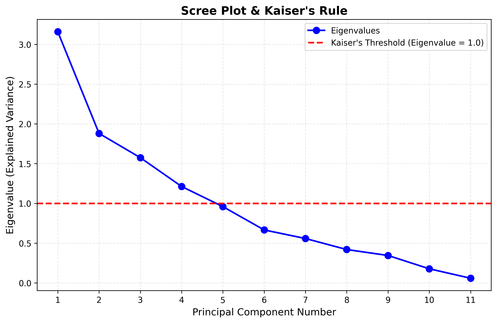
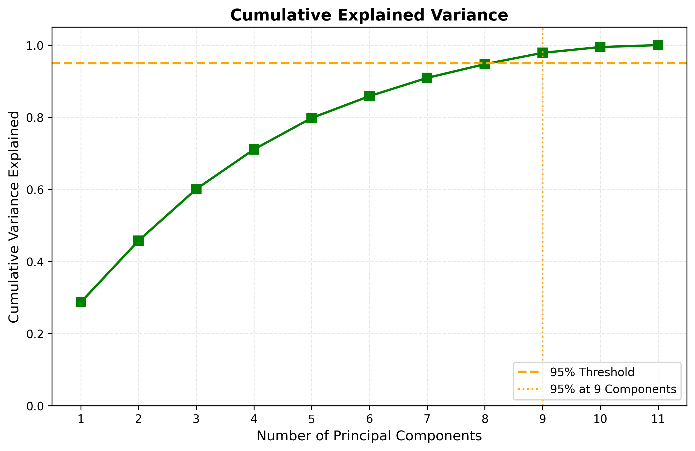

# 2.1 Principal Component Analysis (PCA) Selection

**Dataset**: WineQT.csv  
**Scope**: 11 physicochemical features

---

### 1. How do you select the principal components?

PCA was performed on the **11 numeric features** to reduce dimensionality while preserving data integrity. Using a **95% Cumulative Explained Variance** threshold, we determined that **9 components** are required, reducing dimensions from 11 → 9. Just 8 components capture approximately 94.7% of the total variance, while 9 components retain **97.9%**, showing moderate data redundancy compared to other datasets.

To validate this selection, we also applied the **Elbow Method** and **Kaiser's Rule**. The Elbow Method identifies the "elbow" point on a scree plot where adding more components yields diminishing returns in variance. Simultaneously, Kaiser's Rule suggests retaining only components with an eigenvalue greater than 1.0, ensuring each selected component explains more variance than a single original feature.

Based on these criteria, **9 components** were selected: this choice satisfies the 95% variance threshold (achieving 97.9%), aligns with the gradual decline visible on the scree plot, and retains components with meaningful explanatory power. These criteria together ensure a balanced and efficient dimensionality reduction.

*Figure 1: Scree Plot showing eigenvalues for each principal component. The red dashed line represents Kaiser's threshold (eigenvalue = 1.0). Components above this line contribute more variance than individual original features.*

*Figure 2: Cumulative explained variance plot. The orange dashed line marks the 95% threshold, achieved at 9 components (97.9% total variance).*

---

### 2. Is there any difference while using principal components with highest and lowest values?

**YES, there is a fundamental difference:**

| Feature | Highest Values (Large Eigenvalues) | Lowest Values (Small Eigenvalues) |
| :--- | :--- | :--- |
| **Information** | Contain the **maximum variance** (most information/signal) of the data. | Contain very little variance (almost constant). |
| **Meaning** | Represent the primary patterns, structures, and trends in the dataset. | Typically represent **noise**, redundancy, or multicollinearity (linear dependence). |
| **Usage** | **Must be kept** for dimensionality reduction and model training. | **Should be discarded** to compress data and remove noise without losing significant information. |

**Specific analysis on WineQT:**

*   **High Value Components (PC1, PC2)**:
    *   **PC1 (28.7% variance)** + **PC2 (17.1% variance)** = 45.8% of total information.
    *   Capture the main trends in the data (e.g., balance between alcohol content and acidity). Essential for distinguishing wine quality classes.

*   **Low Value Components (PC10, PC11)**:
    *   **PC11 (0.5% variance)**: Nearly zero contribution.
    *   Represent noise or near-perfect linear relationships with no practical significance.
    *   Removing PC10 and PC11 makes the model lighter with virtually no loss in accuracy.

**Key Insight**: Unlike the Breast Cancer dataset (which reduced from 8 → 4 features, a 50% reduction), the WineQT dataset only reduces from 11 → 9 (18% reduction). This indicates that WineQT features are more complex and carry more unique information with less redundancy.
