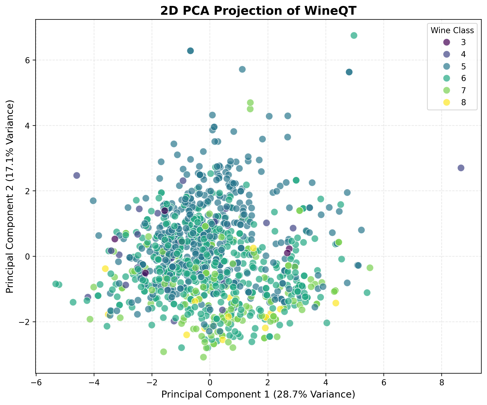

# 2.3 Data Distribution Visualization (2D PCA)

**Dataset**: WineQT.csv  
**Phạm vi**: 11 đặc trưng

Biểu đồ phân tán dữ liệu sau khi giảm xuống 2 chiều (PC1, PC2):

### PCA Scatter Plot

*(Màu sắc biểu thị điểm chất lượng rượu `quality` từ thấp đến cao/tối đến sáng)*

### Nhận xét kết quả

1.  **Sự chồng lấn (Overlapping)**:
    *   Khác với Breast Cancer (tách lớp rõ ràng), các điểm dữ liệu của WineQT **trộn lẫn vào nhau** khá nhiều.
    *   Điều này phản ánh đúng thực tế: PC1+PC2 chỉ giải thích được **45.8%** thông tin (như đã phân tích ở 2.2). Việc nén 11 chiều phức tạp xuống 2 chiều làm mất mát nhiều cấu trúc phân lớp.

2.  **Khó khăn của bài toán**:
    *   Việc phân loại chất lượng rượu (từ 3 đến 8) dựa trên chỉ số hóa học là bài toán khó hơn phân loại ung thư (2 lớp).
    *   Ranh giới giữa rượu điểm 5 và điểm 6 rất mờ nhạt.
    
3.  **Kết luận**:
    *   Chỉ dùng 2 thành phần chính là **không đủ** để phân loại tốt trên tập dữ liệu này. Cần sử dụng nhiều chiều hơn (ví dụ 9 chiều như khuyến nghị) hoặc dùng các mô hình phi tuyến tính mạnh mẽ (Non-linear models).
