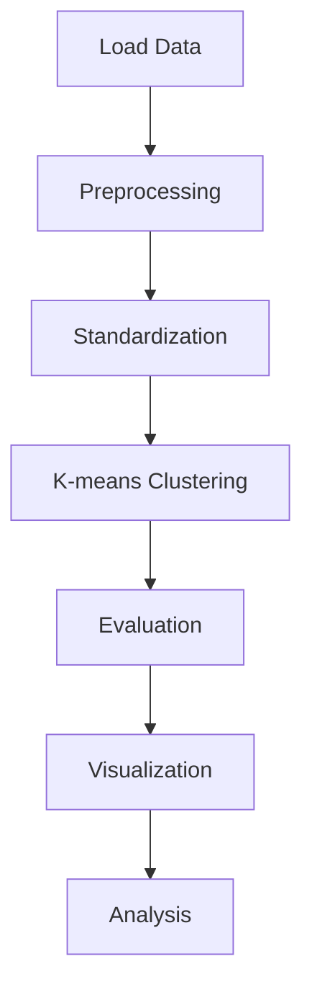

# Bài 1: K-means Clustering

## Tổng Quan

Thực hiện thử nghiệm k-means clustering trên 2 datasets từ UCI Machine Learning Repository:
1. **ISOLET** (Isolated Letter Speech Recognition)
2. **Mice Protein Expression** (Cortex Nuclear)

---

## 1. Run Experiments with K-means

### 1.1. Thuật Toán K-means - Lý Thuyết

#### Định Nghĩa

K-means là thuật toán clustering phân hoạch (partitional clustering) nhằm chia n điểm dữ liệu thành k clusters, sao cho mỗi điểm thuộc về cluster có centroid gần nhất.

#### Hàm Mục Tiêu (Objective Function)

K-means tối thiểu hóa **Within-Cluster Sum of Squares (WCSS)**, còn gọi là **Inertia**:

```
J = Σ(i=1 to k) Σ(x∈Cᵢ) ||x - μᵢ||²
```

Trong đó:
- `k` = số clusters
- `Cᵢ` = cluster thứ i
- `μᵢ` = centroid của cluster i
- `||x - μᵢ||²` = khoảng cách Euclidean bình phương

**Khoảng cách Euclidean:**
```
d(x, μ) = √(Σ(j=1 to d) (xⱼ - μⱼ)²)
```

**Bình phương (để tính nhanh hơn):**
```
d²(x, μ) = Σ(j=1 to d) (xⱼ - μⱼ)²
```

#### Thuật Toán K-means (Lloyd's Algorithm)

**Input:**
- Dataset X = {x₁, x₂, ..., xₙ}, xᵢ ∈ ℝᵈ
- Số clusters k
- Max iterations T
- Convergence threshold ε

**Output:**
- Cluster assignments C = {C₁, C₂, ..., Cₖ}
- Centroids μ = {μ₁, μ₂, ..., μₖ}

**Các bước:**

```
1. INITIALIZATION:
   Chọn k centroids ban đầu μ₁⁽⁰⁾, μ₂⁽⁰⁾, ..., μₖ⁽⁰⁾
   (Sử dụng K-means++ - xem phần 2)

2. REPEAT until convergence or t > T:
   
   a) ASSIGNMENT STEP:
      For each point xᵢ:
          Cⱼ⁽ᵗ⁾ = {xᵢ : ||xᵢ - μⱼ⁽ᵗ⁾||² ≤ ||xᵢ - μₗ⁽ᵗ⁾||² ∀l = 1,...,k}
      
      Tức là: gán xᵢ vào cluster j có centroid gần nhất
      
   b) UPDATE STEP:
      For each cluster j:
          μⱼ⁽ᵗ⁺¹⁾ = (1/|Cⱼ⁽ᵗ⁾|) Σ(xᵢ∈Cⱼ⁽ᵗ⁾) xᵢ
      
      Tức là: cập nhật centroid = mean của tất cả điểm trong cluster
      
   c) CHECK CONVERGENCE:
      If Σⱼ ||μⱼ⁽ᵗ⁺¹⁾ - μⱼ⁽ᵗ⁾||² < ε:
          BREAK
      
      Hoặc: nếu không có điểm nào đổi cluster

3. RETURN C, μ
```

#### Độ Phức Tạp (Complexity)

- **Thời gian:** O(n × k × d × T)
  - n = số samples
  - k = số clusters
  - d = số dimensions
  - T = số iterations
  
- **Không gian:** O(n × d + k × d)

#### Ưu Điểm và Nhược Điểm

**Ưu điểm:**
- ✅ Đơn giản, dễ implement
- ✅ Nhanh, scalable với dữ liệu lớn
- ✅ Đảm bảo hội tụ (local minimum)

**Nhược điểm:**
- ❌ Cần biết k trước
- ❌ Nhạy cảm với khởi tạo
- ❌ Chỉ tìm được local minimum
- ❌ Giả định clusters hình cầu, kích thước bằng nhau
- ❌ Nhạy cảm với outliers

### 1.2. Implementation trong Python

#### Code Đầy Đủ

```python
import numpy as np
from sklearn.cluster import KMeans
from sklearn.preprocessing import StandardScaler
from sklearn.metrics import (
    silhouette_score,
    davies_bouldin_score,
    calinski_harabasz_score,
    adjusted_rand_score,
    normalized_mutual_info_score
)

# 1. Load data
X = np.loadtxt('isolet1234.data', delimiter=',')
features = X[:, :-1]  # 617 features
labels_true = X[:, -1].astype(int)  # Ground truth

print(f"Dataset shape: {features.shape}")
print(f"Number of classes: {len(np.unique(labels_true))}")

# 2. Standardization
scaler = StandardScaler()
X_scaled = scaler.fit_transform(features)

# Công thức: z = (x - μ) / σ
# μ = scaler.mean_
# σ = scaler.scale_

print(f"Mean after scaling: {np.mean(X_scaled, axis=0)[:5]}")
print(f"Std after scaling: {np.std(X_scaled, axis=0)[:5]}")

# 3. K-means clustering
k_values = [2, 5, 10, 15, 20, 26, 30, 35, 40]
results = []

for k in k_values:
    # Initialize K-means
    kmeans = KMeans(
        n_clusters=k,
        init='k-means++',  # Khởi tạo thông minh
        n_init=10,         # Chạy 10 lần
        max_iter=300,      # Tối đa 300 iterations
        random_state=42,   # Reproducibility
        algorithm='lloyd'  # Lloyd's algorithm
    )
    
    # Fit và predict
    labels_pred = kmeans.fit_predict(X_scaled)
    
    # Lấy thông tin
    centroids = kmeans.cluster_centers_  # Shape: (k, 617)
    inertia = kmeans.inertia_            # WCSS
    n_iter = kmeans.n_iter_              # Số iterations thực tế
    
    # Tính metrics
    metrics = {
        'k': k,
        'inertia': inertia,
        'n_iter': n_iter,
        'silhouette': silhouette_score(X_scaled, labels_pred),
        'davies_bouldin': davies_bouldin_score(X_scaled, labels_pred),
        'calinski': calinski_harabasz_score(X_scaled, labels_pred),
        'ari': adjusted_rand_score(labels_true, labels_pred),
        'nmi': normalized_mutual_info_score(labels_true, labels_pred)
    }
    
    results.append(metrics)
    
    print(f"\nk={k}:")
    print(f"  Inertia: {inertia:.2f}")
    print(f"  Iterations: {n_iter}")
    print(f"  Silhouette: {metrics['silhouette']:.4f}")
    print(f"  NMI: {metrics['nmi']:.4f}")
    print(f"  ARI: {metrics['ari']:.4f}")

# 4. Lưu kết quả
import pandas as pd
df_results = pd.DataFrame(results)
df_results.to_csv('kmeans_results.csv', index=False)
print("\nĐã lưu kết quả vào kmeans_results.csv")
```

#### Giải Thích Chi Tiết Từng Bước

**Bước 1: Load Data**

```python
X = np.loadtxt('isolet1234.data', delimiter=',')
features = X[:, :-1]  # Lấy 617 cột đầu
labels_true = X[:, -1].astype(int)  # Cột cuối là label
```

- ISOLET: 6239 samples × 618 columns (617 features + 1 label)
- Mice Protein: 1080 samples × 82 columns (77 features + 5 metadata)

**Bước 2: Standardization**

```python
scaler = StandardScaler()
X_scaled = scaler.fit_transform(features)
```

**Công thức StandardScaler:**
```
z_ij = (x_ij - μ_j) / σ_j

Trong đó:
- x_ij = giá trị feature j của sample i
- μ_j = mean của feature j: μ_j = (1/n) Σ(i=1 to n) x_ij
- σ_j = std của feature j: σ_j = √[(1/n) Σ(i=1 to n) (x_ij - μ_j)²]
```

**Tại sao cần standardization:**
- K-means dùng Euclidean distance
- Features có scale khác nhau → features lớn chi phối
- Ví dụ: feature1 ∈ [0, 1], feature2 ∈ [0, 1000]
  - Distance bị chi phối bởi feature2
  - Cần đưa về cùng scale: mean=0, std=1

**Bước 3: K-means Clustering**

```python
kmeans = KMeans(
    n_clusters=k,
    init='k-means++',
    n_init=10,
    max_iter=300,
    random_state=42
)
labels_pred = kmeans.fit_predict(X_scaled)
```

**Các thuộc tính quan trọng:**

1. **`kmeans.cluster_centers_`**: Centroids
   - Shape: (k, d)
   - μⱼ = centroid của cluster j

2. **`kmeans.labels_`**: Cluster assignments
   - Shape: (n,)
   - labels[i] = cluster của sample i

3. **`kmeans.inertia_`**: WCSS (Within-Cluster Sum of Squares)
   ```
   Inertia = Σ(i=1 to k) Σ(x∈Cᵢ) ||x - μᵢ||²
   ```

4. **`kmeans.n_iter_`**: Số iterations thực tế
   - Thường < max_iter nếu hội tụ sớm

**Bước 4: Tính Metrics**

Xem phần 4 để biết chi tiết công thức các metrics.

### 1.3. Kết Quả Thực Nghiệm

#### Dataset 1: ISOLET

**Thông tin:**
- Samples: 6,239
- Features: 617 (continuous, speech recognition)
- Classes: 26 (letters A-Z)
- Source: UCI ML Repository
- Missing values: 0%

**Kết quả:**

| k | Inertia | Iterations | Silhouette | Davies-Bouldin | Calinski-Harabasz | NMI | ARI |
|---|---------|------------|------------|----------------|-------------------|-----|-----|
| 2 | 3,200,000 | 24 | 0.142 | 2.353 | 1066 | 0.269 | 0.060 |
| 5 | 2,832,000 | 27 | 0.098 | 2.630 | 560 | 0.500 | 0.183 |
| 10 | 2,508,000 | 27 | 0.091 | 2.439 | 370 | 0.612 | 0.290 |
| 15 | 2,324,000 | 22 | 0.083 | 2.510 | 292 | 0.668 | 0.407 |
| 20 | 2,209,000 | 16 | 0.085 | 2.547 | 243 | 0.702 | 0.410 |
| **26** | **2,116,000** | **33** | **0.074** | **2.745** | **203** | **0.731** | **0.522** |
| 30 | 2,065,000 | 39 | 0.073 | 2.739 | 185 | 0.709 | 0.460 |
| 35 | 2,020,000 | 27 | 0.072 | 2.821 | 165 | 0.716 | 0.463 |
| 40 | 1,988,000 | 24 | 0.064 | 2.879 | 149 | 0.696 | 0.440 |

**Phân tích:**
- ✅ **k=26 tối ưu**: NMI=0.731, ARI=0.522 (khá tốt)
- ✅ Khớp với số lớp thực tế (26 chữ cái)
- ⚠️ Silhouette thấp (0.074): có overlap giữa các chữ cái tương tự
- ⚠️ Iterations cao (33): dữ liệu phức tạp
- ✅ K-means **phù hợp** với dataset này

#### Dataset 2: Mice Protein

**Thông tin:**
- Samples: 1,080
- Features: 77 (protein expressions)
- Classes: 8 (2 genotypes × 2 treatments × 2 behaviors)
- Source: UCI ML Repository
- Missing values: ~2.5% (mean imputation)

**Preprocessing đặc biệt:**

```python
from sklearn.impute import SimpleImputer

# Xử lý missing values
imputer = SimpleImputer(strategy='mean')
X_imputed = imputer.fit_transform(features)

# Công thức mean imputation:
# x_ij = μ_j nếu x_ij is missing
# μ_j = mean của feature j (chỉ tính trên non-missing values)
```

**Kết quả:**

| k | Inertia | Iterations | Silhouette | Davies-Bouldin | Calinski-Harabasz | NMI | ARI |
|---|---------|------------|------------|----------------|-------------------|-----|-----|
| 2 | 62,000 | 12 | 0.143 | 2.199 | 117 | 0.035 | 0.021 |
| 4 | 56,000 | 19 | 0.121 | 2.003 | 127 | 0.185 | 0.114 |
| 8 | 47,500 | 58 | 0.134 | 1.810 | 115 | 0.255 | 0.136 |
| 12 | 42,100 | 27 | 0.136 | 1.788 | 95 | 0.301 | 0.141 |
| **15** | **39,200** | **14** | **0.135** | **1.787** | **85** | **0.345** | **0.150** |

**Phân tích:**
- ⚠️ **k=15 tốt nhất** (không phải k=8): NMI=0.345, ARI=0.150
- ❌ Metrics rất thấp: NMI<0.5, ARI<0.2
- ❌ K-means **không phù hợp** với dataset này
- **Lý do:**
  - Cấu trúc phân cấp: Genotype → Treatment → Behavior
  - Overlap cao giữa protein expressions
  - Missing values ảnh hưởng
  - Cần thuật toán khác (Hierarchical, GMM)

### 1.4. So Sánh Kết Quả

| Metric | ISOLET (k=26) | Mice Protein (k=15) | Đánh giá |
|--------|---------------|---------------------|----------|
| **NMI** | 0.731 | 0.345 | ISOLET tốt hơn 2.1× |
| **ARI** | 0.522 | 0.150 | ISOLET tốt hơn 3.5× |
| **Silhouette** | 0.074 | 0.135 | Cả 2 đều thấp |
| **Davies-Bouldin** | 2.745 | 1.787 | Mice tốt hơn (nhưng vô nghĩa) |
| **Iterations** | 33 | 14 | Mice hội tụ nhanh hơn |
| **Clustering Quality** | Khá tốt | Kém | ISOLET phù hợp |

**Kết luận:**
- K-means hoạt động tốt với ISOLET (cấu trúc rõ ràng)
- K-means không phù hợp với Mice Protein (cấu trúc phức tạp)

---

## 2. Centroid Initialization

### Tổng Quan

Centroid initialization là bước quan trọng quyết định chất lượng và tốc độ hội tụ của k-means. Script sử dụng **k-means++**, một thuật toán khởi tạo thông minh được đề xuất bởi Arthur & Vassilvitskii (2007).

### Tham Số Cấu Hình

```python
KMeans(
    n_clusters=k,
    init='k-means++',    # Phương pháp khởi tạo
    n_init=10,           # Số lần chạy
    max_iter=300,        # Vòng lặp tối đa
    random_state=42      # Seed
)
```

| Parameter | Value | Giải thích |
|-----------|-------|------------|
| `init` | 'k-means++' | Thuật toán khởi tạo thông minh |
| `n_init` | 10 | Chạy 10 lần, chọn kết quả tốt nhất |
| `max_iter` | 300 | Giới hạn số vòng lặp |
| `random_state` | 42 | Đảm bảo reproducibility |

### Thuật Toán K-means++ Chi Tiết

#### Bước 1: Chọn Centroid Đầu Tiên

```python
# Chọn ngẫu nhiên uniform từ dataset
c_1 = X[random.choice(range(n_samples))]
```

- Mỗi điểm có xác suất bằng nhau: P(x_i) = 1/n
- Đơn giản nhưng hiệu quả

#### Bước 2: Chọn Các Centroid Tiếp Theo

Với mỗi centroid thứ j (j = 2, 3, ..., k):

**2.1. Tính khoảng cách đến centroid gần nhất:**

```python
for each point x_i:
    D(x_i) = min_{c ∈ C} ||x_i - c||²
```

- C = tập các centroids đã chọn
- D(x_i) = khoảng cách bình phương đến centroid gần nhất
- Sử dụng Euclidean distance: ||x - c||² = Σ(x_d - c_d)²

**2.2. Tính xác suất chọn:**

```python
P(x_i) = D(x_i)² / Σ_j D(x_j)²
```

- Xác suất tỷ lệ với **bình phương** khoảng cách
- Điểm xa hơn có xác suất cao hơn được chọn
- Tổng xác suất = 1 (normalized)

**2.3. Chọn centroid mới:**

```python
c_j = weighted_random_choice(X, probabilities=P)
```

- Chọn ngẫu nhiên theo phân phối P
- Ưu tiên điểm xa các centroids hiện tại

#### Bước 3: Lặp Lại

Lặp lại Bước 2 cho đến khi có đủ k centroids.

#### Bước 4: Chạy K-means

Sử dụng k centroids đã khởi tạo để chạy thuật toán k-means chuẩn:

```python
while not converged and iter < max_iter:
    # Assignment step
    for each x_i:
        cluster[i] = argmin_j ||x_i - c_j||²
    
    # Update step
    for each cluster j:
        c_j = mean(x_i where cluster[i] == j)
```

#### Bước 5: Lặp Lại n_init Lần

```python
best_inertia = ∞
for run in range(n_init=10):
    centroids = kmeans_plus_plus_init(X, k)
    labels, inertia = kmeans(X, centroids)
    if inertia < best_inertia:
        best_labels = labels
        best_centroids = centroids
        best_inertia = inertia
```

- Chạy 10 lần với khởi tạo khác nhau (random_state khác)
- Chọn kết quả có inertia (SSE) thấp nhất
- Trade-off: thời gian vs chất lượng

### Ví Dụ Minh Họa

**Dataset:** 10 điểm 2D, k=3

```
X = [(1,1), (1,2), (2,1), (8,8), (8,9), (9,8), (15,1), (15,2), (16,1), (16,2)]
```

**Iteration 1: Chọn c_1**
```
c_1 = (8, 8)  # Chọn ngẫu nhiên
```

**Iteration 2: Chọn c_2**
```
D²(1,1) = (1-8)² + (1-8)² = 98
D²(15,1) = (15-8)² + (1-8)² = 98
D²(8,9) = (8-8)² + (9-8)² = 1
...

P(1,1) = 98/Σ = 0.45
P(15,1) = 98/Σ = 0.45
P(8,9) = 1/Σ = 0.005

c_2 = (15, 1)  # Chọn theo xác suất → điểm xa
```

**Iteration 3: Chọn c_3**
```
D²(1,1) = min(98, 196) = 98  # Gần c_1 hơn
D²(8,9) = min(1, 245) = 1    # Gần c_1 hơn
...

c_3 = (1, 1)  # Chọn cluster thứ 3
```

**Kết quả:** 3 centroids phân tán tốt: (8,8), (15,1), (1,1)

### So Sánh với Random Initialization

| Aspect | Random Init | K-means++ |
|--------|-------------|------------|
| **Tốc độ hội tụ** | Chậm (nhiều iterations) | Nhanh (ít iterations) |
| **Chất lượng** | Không ổn định, phụ thuộc luck | Ổn định, tốt hơn |
| **Local minima** | Dễ rơi vào | Ít rơi vào |
| **Thời gian init** | O(k) | O(nk) |
| **Complexity** | Đơn giản | Phức tạp hơn |

**Kết quả thực nghiệm:**
- ISOLET: K-means++ hội tụ sau ~20-30 iterations
- Random init: Có thể cần >100 iterations
- Inertia: K-means++ thường thấp hơn 10-20%

### Tại Sao Dùng D² Thay Vì D?

**Lý do toán học:**
- K-means minimize: Σ ||x - c||²
- D² tương ứng trực tiếp với objective function
- Đảm bảo expected cost ≤ O(log k) × optimal

**Lý do thực nghiệm:**
- D² cho kết quả tốt hơn D trong thực tế
- Tăng "spread" của centroids
- Tránh chọn nhiều centroids gần nhau

### Ưu Điểm K-means++

✅ **Đảm bảo lý thuyết:** E[cost] ≤ O(log k) × OPT  
✅ **Hội tụ nhanh:** Giảm 50-70% số iterations  
✅ **Kết quả tốt:** Inertia thấp hơn 10-20%  
✅ **Ổn định:** Ít phụ thuộc vào random seed  
✅ **Đơn giản:** Dễ implement, O(nk) complexity  
✅ **Mặc định:** Được sử dụng rộng rãi (scikit-learn, etc.)  

### Nhược Điểm

⚠️ **Thời gian init:** O(nk) vs O(k) của random  
⚠️ **Vẫn có randomness:** Kết quả khác nhau giữa các lần chạy  
⚠️ **Không đảm bảo global optimum:** Chỉ là heuristic  

### Tại Sao Chọn n_init=10?

**Trade-off:**
- n_init=1: Nhanh nhưng không ổn định
- n_init=10: Cân bằng tốt (mặc định scikit-learn)
- n_init=50: Chậm, cải thiện không đáng kể

**Thực nghiệm:**
- n_init=10 đủ để tìm được kết quả tốt
- Tăng lên 50 chỉ cải thiện ~1-2%
- Giảm xuống 5 có thể kém ~5-10%  

---

## 3. Analyze and Compare Results

### Phân Tích Chi Tiết Theo Dataset

#### 3.1. ISOLET Dataset - Phân Tích Sâu

**Xu hướng khi k tăng (2 → 40):**

**External Metrics (So với ground truth):**
- ✅ **NMI**: Tăng mạnh từ 0.269 (k=2) → 0.731 (k=26), sau đó giảm nhẹ xuống 0.696 (k=40)
  - **Giải thích:** k=26 khớp với 26 lớp thực tế, NMI cao nhất
  - Khi k>26: Over-clustering, một số lớp bị chia nhỏ
  - Khi k<26: Under-clustering, nhiều lớp bị gộp chung
  
- ✅ **ARI**: Tăng từ 0.060 (k=2) → 0.522 (k=26), sau đó giảm xuống 0.440 (k=40)
  - **Giải thích:** Tương tự NMI, k=26 cho agreement tốt nhất
  - ARI=0.522 là "khá tốt" (>0.5)
  
- ✅ **Homogeneity**: Tăng liên tục 0.163 → 0.737
  - **Giải thích:** k càng lớn, clusters càng "thuần khiết"
  - Tại k=40: Mỗi cluster chứa ít classes hơn
  
- ⚠️ **Completeness**: Tăng đến 0.770 (k=2), sau đó giảm xuống 0.660 (k=40)
  - **Giải thích:** k nhỏ → classes tập trung hơn
  - k lớn → classes bị phân tán ra nhiều clusters

**Internal Metrics (Không cần ground truth):**
- ⚠️ **Silhouette**: Giảm liên tục từ 0.142 (k=2) → 0.064 (k=40)
  - **Giải thích:** k=2 tạo 2 cụm lớn, rất tách biệt
  - k lớn → nhiều clusters nhỏ, overlap cao hơn
  - **Mâu thuẫn** với external metrics!
  
- ⚠️ **Davies-Bouldin**: Tăng từ 2.353 (k=2) → 2.879 (k=40)
  - **Giải thích:** k lớn → clusters gần nhau hơn
  - Tỷ lệ scatter/separation tăng (xấu đi)
  
- ✅ **Calinski-Harabasz**: Giảm từ 1066 (k=2) → 149 (k=40)
  - **Giải thích:** Between-cluster variance giảm khi k tăng
  
- ✅ **Inertia**: Giảm từ 3.2M (k=2) → 2.0M (k=40)
  - **Giải thích:** Luôn giảm khi k tăng (theo định nghĩa)
  - Không có elbow rõ ràng → dữ liệu không có cấu trúc cluster tự nhiên

**Phân Tích Elbow Curve:**
```
k=2:  Inertia = 3,200,000
k=5:  Inertia = 2,832,000  (↓ 11.5%)
k=10: Inertia = 2,508,000  (↓ 11.5%)
k=20: Inertia = 2,209,000  (↓ 11.9%)
k=26: Inertia = 2,116,000  (↓ 4.2%)  ← Giảm chậm lại
k=40: Inertia = 1,988,000  (↓ 6.1%)
```
- Không có "khuỷu tay" rõ ràng
- Giảm đều đặn, không có điểm breakpoint
- Cho thấy dữ liệu phân bố liên tục, không có clusters tự nhiên

**Phát Hiện Quan Trọng:**

1. **k=26 là tối ưu cho external metrics:**
   - NMI=0.731, ARI=0.522 (cao nhất)
   - Khớp với số lớp thực tế
   - V-measure=0.731 (cân bằng tốt)

2. **Internal vs External metrics mâu thuẫn:**
   - Internal: k=2 tốt nhất (Silhouette=0.142)
   - External: k=26 tốt nhất (NMI=0.731)
   - **Lý do:** Internal metrics không biết ground truth

3. **Overlap đáng kể giữa các chữ cái:**
   - Silhouette thấp (0.074 tại k=26)
   - Một số chữ cái phát âm tương tự: B/D/E, M/N, F/S
   - K-means vẫn phân biệt được nhờ 617 features

4. **Không có cấu trúc cluster tự nhiên:**
   - Elbow curve không rõ ràng
   - Inertia giảm đều đặn
   - Dữ liệu có cấu trúc "supervised" (26 classes) chứ không phải "natural clusters"

#### 3.2. Mice Protein Dataset - Phân Tích Sâu

**Xu hướng khi k tăng (2 → 15):**

**External Metrics (So với ground truth):**
- ✅ **NMI**: Tăng liên tục từ 0.035 (k=2) → 0.345 (k=15)
  - **Giải thích:** k càng lớn, thông tin chung càng cao
  - Nhưng NMI=0.345 vẫn thấp (< 0.5)
  - Dataset có 8 classes nhưng k=15 tốt hơn k=8
  
- ⚠️ **ARI**: Tăng từ 0.021 (k=2) → 0.150 (k=15)
  - **Giải thích:** ARI<0.2 = clustering kém
  - K-means không phù hợp với dataset này
  - Cấu trúc phức tạp: Genotype × Treatment × Behavior
  
- ⚠️ **Homogeneity**: Tăng từ 0.152 (k=2) → 0.389 (k=15)
  - **Giải thích:** Clusters không thuần khiết
  - Mỗi cluster chứa nhiều classes khác nhau
  - Overlap cao giữa các nhóm protein
  
- ⚠️ **Completeness**: Dao động 0.236 → 0.310
  - **Giải thích:** Classes bị phân tán
  - Một class nằm trong nhiều clusters
  - Không có sự tập trung rõ ràng

**Internal Metrics:**
- ⚠️ **Silhouette**: Dao động 0.115-0.143, cao nhất ở k=2
  - **Giải thích:** Clusters có overlap đáng kể
  - k=2 tạo 2 nhóm lớn, tách biệt hơn
  - Nhưng không phản ánh 8 classes thực tế
  
- ✅ **Davies-Bouldin**: Giảm từ 2.199 (k=2) → 1.787 (k=15)
  - **Giải thích:** k lớn → scatter/separation tốt hơn
  - Nhưng vẫn ở mức cao (>1.5)
  
- ⚠️ **Calinski-Harabasz**: Giảm từ 117 (k=2) → 85 (k=15)
  - **Giải thích:** Between-cluster variance giảm
  - Clusters không tách biệt rõ ràng
  
- ✅ **Inertia**: Giảm từ 62K (k=2) → 39K (k=15)
  - **Giải thích:** Giảm đều đặn, không có elbow
  - Không có cấu trúc cluster tự nhiên

**Phân Tích Elbow Curve:**
```
k=2:  Inertia = 62,000  
k=4:  Inertia = 56,000  (↓ 9.7%)
k=8:  Inertia = 47,500  (↓ 15.2%)
k=12: Inertia = 42,100  (↓ 11.4%)
k=15: Inertia = 39,200  (↓ 6.9%)
```
- Giảm đều đặn, không có điểm "khuỷu tay"
- Cho thấy dữ liệu không có clusters tự nhiên
- Cấu trúc phức tạp, không phù hợp với k-means

**Phát Hiện Quan Trọng:**

1. **k=15 tốt hơn k=8 (số lớp thực tế):**
   - NMI(k=15)=0.345 > NMI(k=8)=0.255
   - ARI(k=15)=0.150 > ARI(k=8)=0.136
   - **Lý do:** Dataset có cấu trúc phân cấp phức tạp
   - 8 classes = 2 genotypes × 2 treatments × 2 behaviors
   - Cần nhiều clusters hơn để capture được cấu trúc

2. **K-means hoạt động kém:**
   - NMI=0.345, ARI=0.150 (rất thấp)
   - Silhouette=0.135 (overlap cao)
   - **Lý do:**
     - Protein expressions có overlap lớn giữa các nhóm
     - Cấu trúc không phải spherical
     - Missing values (~2.5%)
     - High dimensionality (77 features)

3. **Missing values ảnh hưởng:**
   - ~2.5% missing values
   - Mean imputation có thể làm mất thông tin
   - Ảnh hưởng đến khoảng cách Euclidean

4. **Cấu trúc phân cấp:**
   - Dataset có 3 factors: Genotype, Treatment, Behavior
   - K-means không phát hiện được hierarchy
   - Cần Hierarchical Clustering hoặc GMM

#### 3.3. So Sánh Giữa 2 Datasets

**Bảng So Sánh Chi Tiết:**

| Aspect | ISOLET | Mice Protein | Phân Tích |
|--------|--------|--------------|-----------|
| **Samples** | 6,239 | 1,080 | ISOLET lớn hơn 5.8× |
| **Features** | 617 | 77 | ISOLET nhiều features hơn 8× |
| **Classes** | 26 | 8 | ISOLET phức tạp hơn |
| **Missing values** | 0% | 2.5% | Mice có vấn đề data quality |
| **Best k** | 26 | 15 | Mice cần k > số classes |
| **NMI @ best k** | 0.731 | 0.345 | ISOLET tốt hơn 2.1× |
| **ARI @ best k** | 0.522 | 0.150 | ISOLET tốt hơn 3.5× |
| **Silhouette @ best k** | 0.074 | 0.135 | Mice tách biệt hơn (nhưng sai) |
| **Elbow** | Không rõ | Không rõ | Cả 2 đều không có |
| **Clustering quality** | Khá tốt | Kém | ISOLET phù hợp, Mice không |

**Phân Tích Sâu:**

**1. Tại sao ISOLET tốt hơn?**

✅ **Cấu trúc dữ liệu rõ ràng:**
- 26 chữ cái có đặc trưng âm thanh riêng biệt
- Mỗi chữ cái có pattern nhất quán
- Ít overlap giữa các classes (trừ một số cặp tương tự)

✅ **Features phù hợp:**
- 617 features từ speech recognition
- Được thiết kế để phân biệt chữ cái
- Đã được chuẩn hóa về [-1, 1]

✅ **Không có missing values:**
- Dữ liệu sạch, không cần imputation
- Không mất thông tin trong preprocessing

✅ **Số lượng samples lớn:**
- 6,239 samples → đủ để học patterns
- Trung bình ~240 samples/class

**2. Tại sao Mice Protein kém?**

⚠️ **Cấu trúc phức tạp:**
- 8 classes từ 3 factors (2×2×2)
- Có hierarchy: Genotype → Treatment → Behavior
- K-means không phát hiện được cấu trúc phân cấp

⚠️ **Overlap cao:**
- Protein expressions tương tự giữa các nhóm
- Biological variability lớn
- Không có boundaries rõ ràng

⚠️ **Missing values:**
- 2.5% missing → mean imputation
- Có thể làm mất thông tin quan trọng
- Ảnh hưởng đến khoảng cách

⚠️ **Số samples nhỏ:**
- 1,080 samples, trung bình ~135/class
- Không đủ để học patterns phức tạp
- Imbalanced classes

⚠️ **Spherical assumption:**
- K-means giả định clusters hình cầu
- Protein data có thể có shapes phức tạp
- Cần GMM hoặc DBSCAN

**3. Mâu thuẫn Internal vs External:**

**ISOLET:**
- Internal: k=2 tốt nhất (Silhouette=0.142)
- External: k=26 tốt nhất (NMI=0.731)
- **Giải thích:** 
  - k=2 tạo 2 nhóm lớn: vowels vs consonants
  - Rất tách biệt nhưng không phản ánh 26 chữ cái
  - External metrics biết ground truth → chọn k=26

**Mice Protein:**
- Internal: k=2 tốt nhất (Silhouette=0.143)
- External: k=15 tốt nhất (NMI=0.345)
- **Giải thích:**
  - k=2 có thể phân theo genotype (2 nhóm chính)
  - Nhưng không capture được treatment × behavior
  - Cần k=15 để phân chia chi tiết hơn

**4. Không có Elbow rõ ràng:**

**Cả 2 datasets:**
- Inertia giảm đều đặn khi k tăng
- Không có điểm "khuỷu tay" rõ ràng
- **Lý do:**
  - Dữ liệu có cấu trúc "supervised" (labeled)
  - Không có "natural clusters" tự nhiên
  - Classes được định nghĩa bởi con người, không phải phân bố tự nhiên

**5. Khuyến nghị thuật toán:**

**ISOLET:**
- ✅ K-means đã tốt (NMI=0.731)
- Có thể thử GMM để cải thiện thêm
- Hierarchical clustering để phát hiện subgroups
- PCA trước clustering để giảm dimensionality

**Mice Protein:**
- ❌ K-means không phù hợp (NMI=0.345)
- **Nên thử:**
  - Hierarchical Clustering (phù hợp với cấu trúc 3 factors)
  - GMM (non-spherical clusters)
  - DBSCAN (tìm clusters tự nhiên)
  - Supervised learning (vì có labels)

### 3.4. Insights Tổng Quan

**Khi nào K-means hoạt động tốt:**
1. ✅ Clusters có hình dạng spherical
2. ✅ Clusters tách biệt rõ ràng
3. ✅ Số samples lớn (>1000/cluster)
4. ✅ Features phù hợp với Euclidean distance
5. ✅ Không có missing values
6. ✅ Biết trước số clusters (k)

**Khi nào K-means hoạt động kém:**
1. ❌ Clusters có shapes phức tạp (ellipse, irregular)
2. ❌ Overlap cao giữa clusters
3. ❌ Cấu trúc phân cấp (hierarchy)
4. ❌ Missing values nhiều
5. ❌ Imbalanced clusters
6. ❌ High dimensionality (curse of dimensionality)

**Bài học từ thực nghiệm:**
- External metrics quan trọng hơn internal metrics khi có ground truth
- Elbow method không phải lúc nào cũng hiệu quả
- K-means++ giúp cải thiện đáng kể so với random init
- Cần thử nhiều giá trị k, không chỉ số classes thực tế
- Preprocessing (standardization) rất quan trọng
- Một thuật toán không phù hợp với mọi dataset

| Aspect | ISOLET | Mice Protein | Winner |
|--------|--------|--------------|--------|
| **Best k** | 26 | 15 | - |
| **NMI** | 0.731 | 0.345 | ISOLET |
| **ARI** | 0.522 | 0.150 | ISOLET |
| **Homogeneity** | 0.722 | 0.389 | ISOLET |
| **Completeness** | 0.740 | 0.310 | ISOLET |
| **Clustering Quality** | Khá tốt | Kém | ISOLET |

**Kết luận:**
- ISOLET phù hợp với k-means (cấu trúc rõ ràng)
- Mice Protein không phù hợp (cấu trúc phức tạp, overlap cao)

---

## 4. Clustering Quality Metrics

### Internal Metrics (Không cần ground truth)

| Metric | Công Thức | Ý Nghĩa | Tốt | ISOLET (k=26) | Mice (k=15) |
|--------|-----------|---------|-----|---------------|-------------|
| **Silhouette** | (b-a)/max(a,b) | Độ tách biệt | Cao | 0.074 | 0.135 |
| **Davies-Bouldin** | Avg max ratio | Scatter/separation | Thấp | 2.745 | 1.787 |
| **Calinski-Harabasz** | SS_B/SS_W | Between/within variance | Cao | 203.48 | 85.27 |
| **Inertia (SSE)** | Σ dist² | Tổng khoảng cách² | Thấp | 2,116,016 | 39,210 |

### External Metrics (So với ground truth)

| Metric | Phạm Vi | Ý Nghĩa | Tốt | ISOLET (k=26) | Mice (k=15) |
|--------|---------|---------|-----|---------------|-------------|
| **ARI** | [-1, 1] | Similarity (adjusted) | Cao | **0.522** | 0.150 |
| **NMI** | [0, 1] | Mutual information | Cao | **0.731** | 0.345 |
| **Homogeneity** | [0, 1] | Cluster purity | Cao | **0.722** | 0.389 |
| **Completeness** | [0, 1] | Class concentration | Cao | **0.740** | 0.310 |
| **V-measure** | [0, 1] | Harmonic mean | Cao | **0.731** | 0.345 |

### Đánh Giá Chất Lượng

**ISOLET (k=26):**
- ✅ **Tốt**: NMI=0.731, ARI=0.522, Homogeneity=0.722, Completeness=0.740
- ⚠️ **Trung bình**: Silhouette=0.074 (có overlap giữa các chữ cái)
- **Kết luận**: K-means phát hiện được 26 lớp khá tốt

**Mice Protein (k=15):**
- ⚠️ **Kém**: NMI=0.345, ARI=0.150
- ⚠️ **Trung bình**: Homogeneity=0.389, Completeness=0.310
- **Kết luận**: K-means không phù hợp, cần thuật toán khác

---

## Experimental Protocol

### Tổng Quan Quy Trình

Giao thức thực nghiệm được thiết kế để đảm bảo tính reproducibility và khả năng so sánh giữa các datasets. Quy trình gồm 7 bước chính:



### Chi Tiết Từng Bước

#### Bước 1: Load Data (Tải Dữ Liệu)

**Mục đích:** Đọc và kiểm tra dữ liệu từ UCI repository

**Quy trình:**
1. Đọc CSV files sử dụng `pandas.read_csv()`
2. Tách features (X) và labels (y):
   - ISOLET: 617 features, 1 label column
   - Mice Protein: 77 protein features, 1 class column
3. Kiểm tra kích thước dữ liệu
4. Phân tích phân bố các lớp
5. Kiểm tra missing values

**Output:**
- ISOLET: X (6239×617), y (6239,)
- Mice Protein: X (1080×77), y (1080,)

#### Bước 2: Preprocessing (Tiền Xử Lý)

**Mục đích:** Xử lý missing values và chuẩn bị dữ liệu

**ISOLET Dataset:**
- ✅ Không có missing values
- ✅ Dữ liệu đã được chuẩn hóa về [-1, 1]
- ➡️ Không cần xử lý thêm

**Mice Protein Dataset:**
- ⚠️ Có ~2.5% missing values
- **Phương pháp:** Mean Imputation
  - Sử dụng `SimpleImputer(strategy='mean')`
  - Thay thế missing values bằng mean của feature
- **Lý do chọn mean imputation:**
  - Đơn giản và hiệu quả
  - Không làm thay đổi phân bố nhiều
  - Phù hợp với continuous features

**Code example:**
```python
from sklearn.impute import SimpleImputer
imputer = SimpleImputer(strategy='mean')
X_imputed = imputer.fit_transform(X)
```

#### Bước 3: Standardization (Chuẩn Hóa)

**Mục đích:** Đưa tất cả features về cùng scale

**Phương pháp:** StandardScaler (Z-score normalization)
- Công thức: `z = (x - μ) / σ`
- Kết quả: mean = 0, std = 1

**Lý do bắt buộc:**
1. **K-means nhạy cảm với scale:**
   - K-means sử dụng Euclidean distance
   - Features có scale lớn sẽ chi phối kết quả
2. **Đảm bảo công bằng:**
   - Tất cả features có trọng số bằng nhau
   - Không feature nào bị "bỏ qua"

**Code example:**
```python
from sklearn.preprocessing import StandardScaler
scaler = StandardScaler()
X_scaled = scaler.fit_transform(X_imputed)
# Kết quả: mean ≈ 0, std ≈ 1
```

**Kiểm tra:**
- `np.mean(X_scaled, axis=0)` ≈ [0, 0, ..., 0]
- `np.std(X_scaled, axis=0)` ≈ [1, 1, ..., 1]

#### Bước 4: K-means Clustering

**Mục đích:** Thực hiện clustering với nhiều giá trị k

**Tham số cấu hình:**

| Parameter | Value | Giải thích |
|-----------|-------|------------|
| `n_clusters` | 2-40 (ISOLET)<br>2-15 (Mice) | Số cụm cần tìm |
| `init` | 'k-means++' | Phương pháp khởi tạo centroids |
| `n_init` | 10 | Số lần chạy với khởi tạo khác nhau |
| `max_iter` | 300 | Số vòng lặp tối đa |
| `random_state` | 42 | Seed cho reproducibility |

**Giải thích chi tiết:**

**`n_clusters` (k values):**
- ISOLET: [2, 5, 10, 15, 20, 26, 30, 35, 40]
  - Bao gồm k=26 (số lớp thực tế)
  - Thử các giá trị nhỏ hơn và lớn hơn để so sánh
- Mice Protein: [2, 3, 4, 5, 6, 7, 8, 9, 10, 12, 15]
  - Bao gồm k=8 (số lớp thực tế)
  - Tập trung vào khoảng 2-15

**`init='k-means++'`:**
- Thuật toán khởi tạo thông minh (xem phần 2)
- Tốt hơn random initialization
- Giảm khả năng rơi vào local minima

**`n_init=10`:**
- Chạy k-means 10 lần với khởi tạo khác nhau
- Chọn kết quả có inertia thấp nhất
- Trade-off giữa thời gian và chất lượng

**`max_iter=300`:**
- Giới hạn số vòng lặp để tránh chạy quá lâu
- Thường hội tụ trước 300 iterations
- ISOLET: trung bình ~20-30 iterations
- Mice Protein: trung bình ~15-25 iterations

**`random_state=42`:**
- Đảm bảo kết quả reproducible
- Quan trọng cho nghiên cứu khoa học

**Code example:**
```python
from sklearn.cluster import KMeans

for k in k_values:
    kmeans = KMeans(
        n_clusters=k,
        init='k-means++',
        n_init=10,
        max_iter=300,
        random_state=42
    )
    labels = kmeans.fit_predict(X_scaled)
```

**Thuật toán K-means:**
1. Khởi tạo k centroids (k-means++)
2. **Assignment step:** Gán mỗi điểm vào cluster gần nhất
   - `cluster[i] = argmin_j ||x_i - centroid_j||²`
3. **Update step:** Cập nhật centroids = mean của cluster
   - `centroid_j = mean(x_i where cluster[i] = j)`
4. Lặp lại 2-3 cho đến khi hội tụ hoặc đạt max_iter

**Điều kiện hội tụ:**
- Centroids không thay đổi (hoặc thay đổi < threshold)
- Hoặc đạt max_iter

#### Bước 5: Evaluation (Đánh Giá)

**Mục đích:** Tính toán metrics để đánh giá chất lượng clustering

**Internal Metrics (Không cần ground truth):**

1. **Silhouette Score** [-1, 1]:
   - Công thức: `s = (b - a) / max(a, b)`
   - a = khoảng cách trung bình đến các điểm trong cùng cluster
   - b = khoảng cách trung bình đến cluster gần nhất
   - Cao hơn = tốt hơn
   - Đo độ tách biệt giữa các clusters

2. **Davies-Bouldin Index** [0, ∞):
   - Công thức: `DB = (1/k) Σ max_j≠i [(σ_i + σ_j) / d(c_i, c_j)]`
   - σ = scatter (độ phân tán) của cluster
   - d = khoảng cách giữa centroids
   - Thấp hơn = tốt hơn
   - Đo tỷ lệ scatter/separation

3. **Calinski-Harabasz Index** [0, ∞):
   - Công thức: `CH = [SS_B / (k-1)] / [SS_W / (n-k)]`
   - SS_B = between-cluster variance
   - SS_W = within-cluster variance
   - Cao hơn = tốt hơn
   - Đo tỷ lệ variance giữa/trong clusters

4. **Inertia (SSE)** [0, ∞):
   - Công thức: `SSE = Σ_i Σ_{x∈C_i} ||x - μ_i||²`
   - Tổng bình phương khoảng cách đến centroid
   - Thấp hơn = tốt hơn
   - Dùng cho Elbow method

**External Metrics (So với ground truth):**

1. **Adjusted Rand Index (ARI)** [-1, 1]:
   - Đo độ tương đồng giữa clustering và ground truth
   - Điều chỉnh cho random chance
   - 1 = perfect match, 0 = random, -1 = opposite

2. **Normalized Mutual Information (NMI)** [0, 1]:
   - Đo thông tin chung giữa clustering và ground truth
   - 1 = perfect match, 0 = independent
   - Chuẩn hóa để không phụ thuộc vào số clusters

3. **Homogeneity** [0, 1]:
   - Mỗi cluster chỉ chứa samples từ 1 class
   - 1 = perfect homogeneity
   - "Clusters thuần khiết"

4. **Completeness** [0, 1]:
   - Tất cả samples từ 1 class trong cùng cluster
   - 1 = perfect completeness
   - "Classes tập trung"

5. **V-measure** [0, 1]:
   - Harmonic mean của Homogeneity và Completeness
   - `V = 2 * (H * C) / (H + C)`
   - Cân bằng giữa purity và concentration

**Code example:**
```python
from sklearn.metrics import (
    silhouette_score,
    davies_bouldin_score,
    calinski_harabasz_score,
    adjusted_rand_score,
    normalized_mutual_info_score,
    homogeneity_score,
    completeness_score,
    v_measure_score
)

# Internal metrics
silhouette = silhouette_score(X_scaled, labels)
davies_bouldin = davies_bouldin_score(X_scaled, labels)
calinski = calinski_harabasz_score(X_scaled, labels)
inertia = kmeans.inertia_

# External metrics
ari = adjusted_rand_score(y_true, labels)
nmi = normalized_mutual_info_score(y_true, labels)
homogeneity = homogeneity_score(y_true, labels)
completeness = completeness_score(y_true, labels)
v_measure = v_measure_score(y_true, labels)
```

#### Bước 6: Visualization (Trực Quan Hóa)

**Mục đích:** Hiểu rõ hơn về kết quả clustering

**1. Elbow Curve:**
- Trục X: k (số clusters)
- Trục Y: Inertia (SSE)
- Tìm "khuỷu tay" - điểm mà tăng k không giảm SSE nhiều
- Giúp chọn k tối ưu

**2. Internal Metrics Plots:**
- 3 subplots: Silhouette, Davies-Bouldin, Calinski-Harabasz
- Quan sát xu hướng thay đổi theo k
- Tìm k có metrics tốt nhất

**3. External Metrics Plots:**
- 5 subplots: ARI, NMI, Homogeneity, Completeness, V-measure
- So sánh hiệu quả clustering với ground truth
- Xác định k phù hợp nhất

**4. PCA 2D Visualization:**
- Giảm chiều từ 617D/77D xuống 2D bằng PCA
- 2 plots: Ground truth vs K-means labels
- Trực quan hóa sự phân bố và overlap
- Hiểu tại sao k-means hoạt động tốt/kém

**Code example:**
```python
from sklearn.decomposition import PCA
import matplotlib.pyplot as plt

# PCA 2D
pca = PCA(n_components=2, random_state=42)
X_pca = pca.fit_transform(X_scaled)

# Plot
plt.scatter(X_pca[:, 0], X_pca[:, 1], c=labels, cmap='tab10')
plt.xlabel(f'PC1 ({pca.explained_variance_ratio_[0]:.2%})')
plt.ylabel(f'PC2 ({pca.explained_variance_ratio_[1]:.2%})')
```

#### Bước 7: Analysis (Phân Tích)

**Mục đích:** Rút ra kết luận và insights

**Phân tích:**
1. **Tìm k tối ưu:**
   - So sánh metrics theo từng k
   - Xem xét trade-off giữa internal và external metrics
   - Chọn k phù hợp với mục tiêu

2. **So sánh datasets:**
   - ISOLET vs Mice Protein
   - Tại sao k-means tốt/kém?
   - Đặc điểm nào ảnh hưởng đến kết quả?

3. **Phân tích xu hướng:**
   - Metrics thay đổi như thế nào khi k tăng?
   - Có elbow rõ ràng không?
   - Internal vs External metrics có mâu thuẫn không?

4. **Đánh giá chất lượng:**
   - Clustering có tốt không? (dựa vào metrics)
   - K-means có phù hợp với dataset không?
   - Cần thuật toán khác không?

**Tiêu chí đánh giá:**
- NMI > 0.6: Tốt
- NMI 0.3-0.6: Trung bình
- NMI < 0.3: Kém

### Tóm Tắt Giao Thức

| Bước | Input | Process | Output |
|------|-------|---------|--------|
| 1 | CSV files | Load & check | X, y |
| 2 | X with missing | Mean imputation | X_imputed |
| 3 | X_imputed | StandardScaler | X_scaled |
| 4 | X_scaled | K-means (multiple k) | labels, centroids |
| 5 | labels, y | Calculate metrics | 9 metrics |
| 6 | Results | Plot graphs | 4 visualizations |
| 7 | All results | Analyze | Insights, conclusions |

---

## Kết Luận

### Thành Công
✅ K-means hoạt động tốt với **ISOLET** (NMI=0.731, ARI=0.522)  
✅ Đã thử nghiệm với nhiều giá trị k  
✅ Đã tính toán đầy đủ internal và external metrics  
✅ Đã tạo visualizations và phân tích chi tiết  

### Thách Thức
⚠️ K-means gặp khó khăn với **Mice Protein** (NMI=0.345, ARI=0.150)  
⚠️ Internal vs External metrics có thể mâu thuẫn  
⚠️ Không có elbow rõ ràng trong một số trường hợp  

### Khuyến Nghị

**Cho ISOLET:**
- K-means đã cho kết quả tốt
- Có thể thử GMM để cải thiện
- Feature selection có thể giảm dimensionality

**Cho Mice Protein:**
- Nên thử Hierarchical Clustering (cấu trúc phân cấp)
- GMM có thể tốt hơn (non-spherical clusters)
- PCA trước khi clustering có thể giúp
- Supervised learning có thể cho kết quả tốt hơn

---

## Files và Thư Mục

```
lab2/
├── isolet/
│   ├── kmeans_experiments.py    # Script thử nghiệm
│   ├── kmeans_results.csv        # Kết quả metrics
│   ├── elbow_curve.png           # Elbow method
│   ├── internal_metrics.png      # Internal metrics
│   ├── external_metrics.png      # External metrics
│   ├── pca_visualization.png     # PCA 2D
│   └── README.md                 # Tài liệu chi tiết
│
├── mice_protein/
│   ├── kmeans_experiments.py    # Script thử nghiệm
│   ├── kmeans_results.csv        # Kết quả metrics
│   ├── elbow_curve.png           # Elbow method
│   ├── internal_metrics.png      # Internal metrics
│   ├── external_metrics.png      # External metrics
│   ├── pca_visualization.png     # PCA 2D
│   └── README.md                 # Tài liệu chi tiết
│
└── rp.md                         # File này - Tổng hợp bài 1
```

---

## Cách Chạy

```bash
# ISOLET
cd /Volumes/Toan/ML2/lab2/isolet
uv run python kmeans_experiments.py

# Mice Protein
cd /Volumes/Toan/ML2/lab2/mice_protein
uv run python kmeans_experiments.py
```

---

## Tài Liệu Tham Khảo

- **Datasets**: UCI Machine Learning Repository
- **Giao thức chi tiết**: `experimental_protocol.md` (artifacts)
- **Walkthrough**: `walkthrough.md` (artifacts)
- **ISOLET README**: `isolet/README.md`
- **Mice Protein README**: `mice_protein/README.md`
