# Lab 4: Decision Tree & Random Forest Results

### Mice_Protein

- **Dataset**: Mice_Protein
- **Train/Test Split**: 80/20
- **Train Size**: 864, **Test Size**: 216

#### Data Analysis
| Class Distribution | PCA Projection |
| :---: | :---: |
| 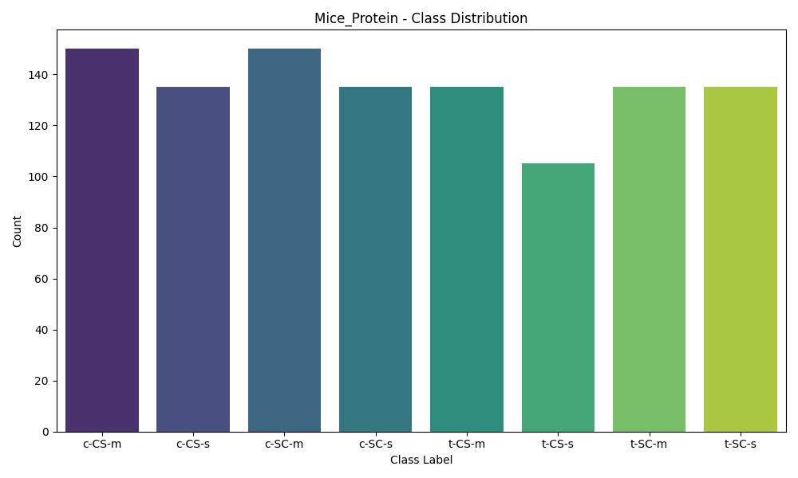 | 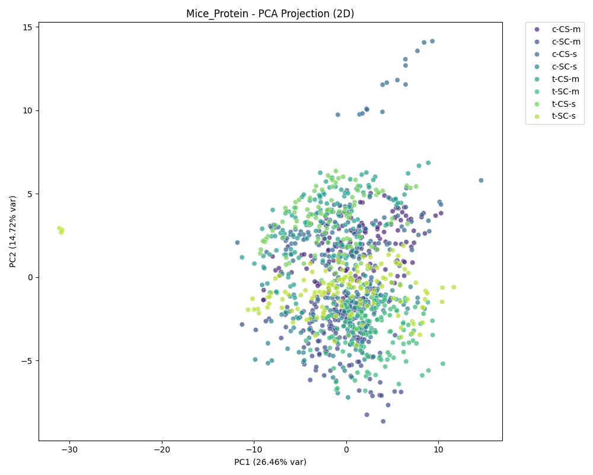 |

#### 1. Decision Tree (DT)
- **Accuracy**: 0.8981
- **Classification Error**: 0.1019
- **Weighted Precision**: 0.9017
- **Weighted Recall**: 0.8981
- **Weighted F1-Score**: 0.8979
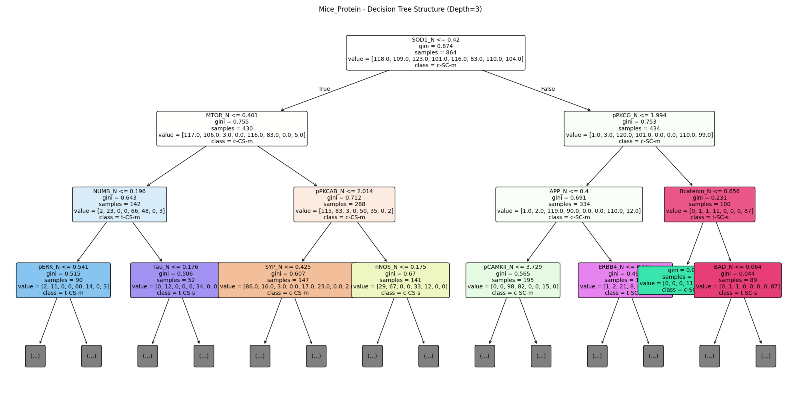
*Figure: First few layers of the Decision Tree.*

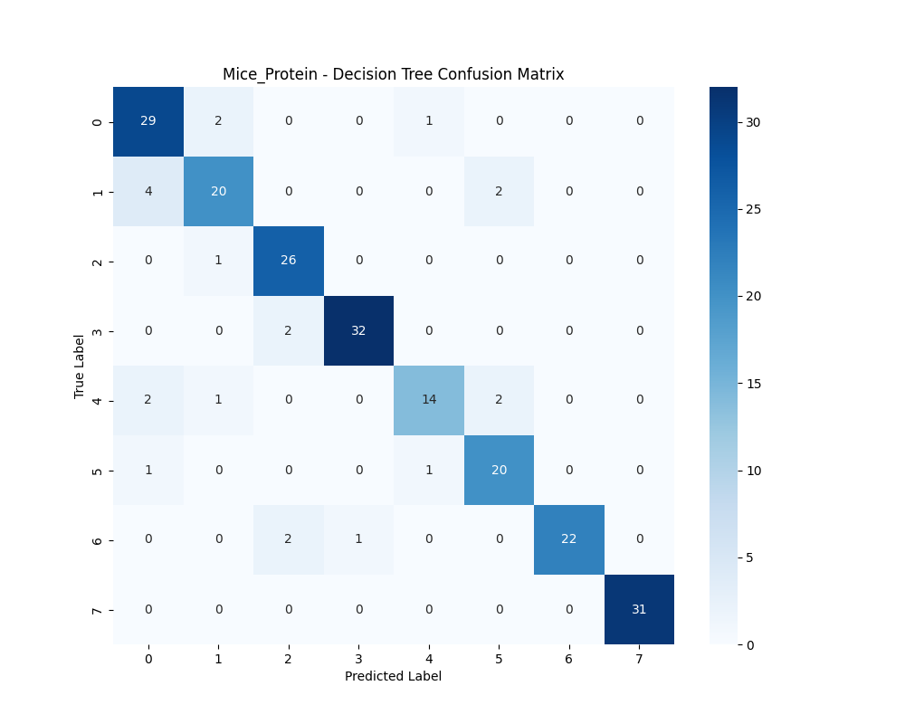

#### 2. Random Forest (RF)
- **K (Trees)**: 100
- **Accuracy**: 0.9954
- **Classification Error**: 0.0046
- **Weighted Precision**: 0.9955
- **Weighted Recall**: 0.9954
- **Weighted F1-Score**: 0.9954
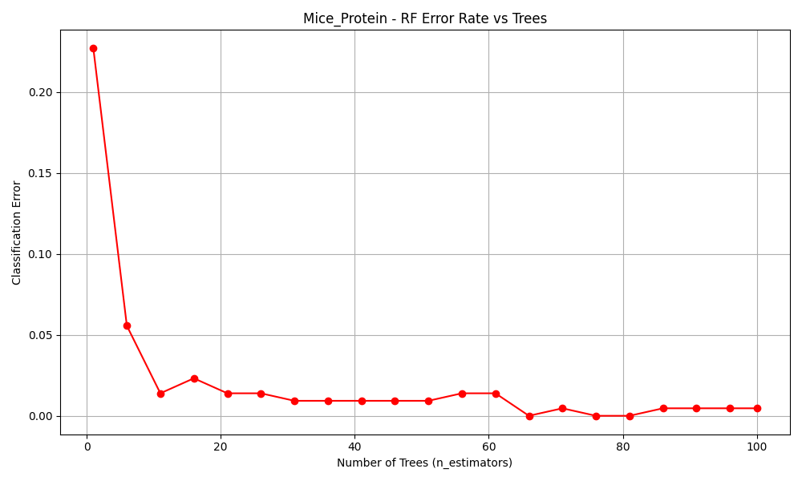
*Figure: Error rate decreases as number of trees increases.*

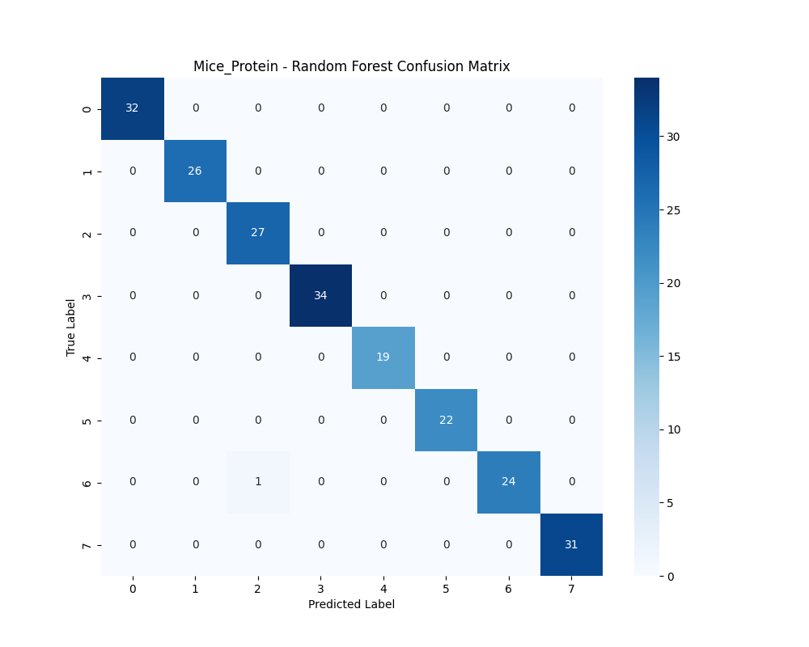

#### Top Features (Random Forest)
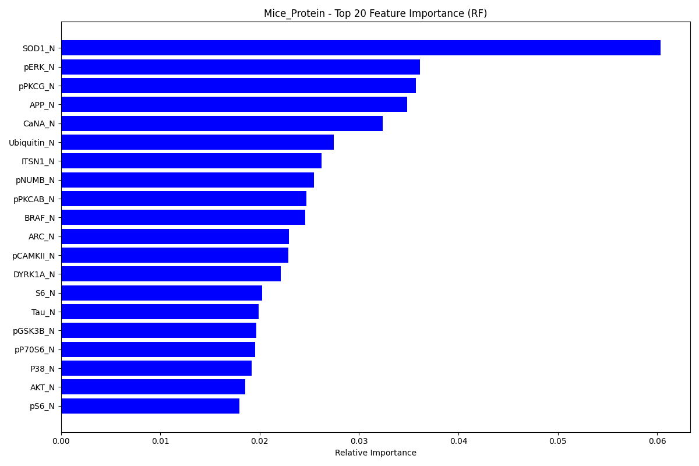

#### Comparison
- RF Improvement over DT: 9.72%
- Random Forest outperformed Decision Tree as expected, reducing the variance and overfitting often seen in single decision trees.

### Isolet

- **Dataset**: Isolet
- **Train/Test Split**: 80/20
- **Train Size**: 6237, **Test Size**: 1560

#### Data Analysis
| Class Distribution | PCA Projection |
| :---: | :---: |
| 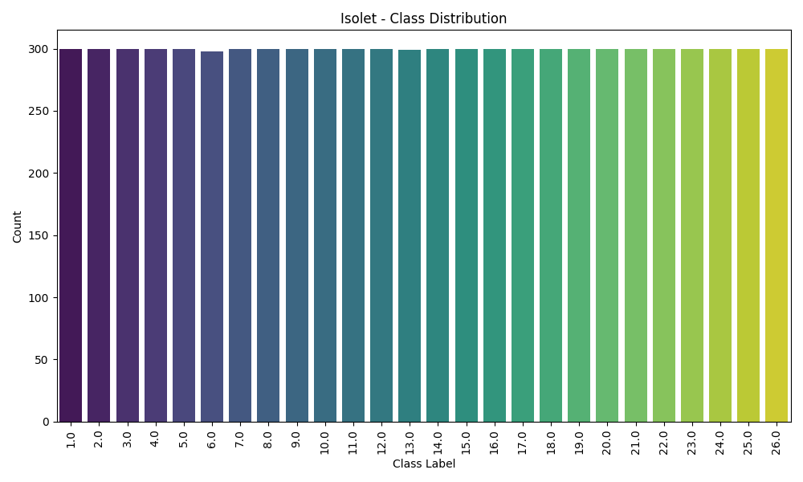 | 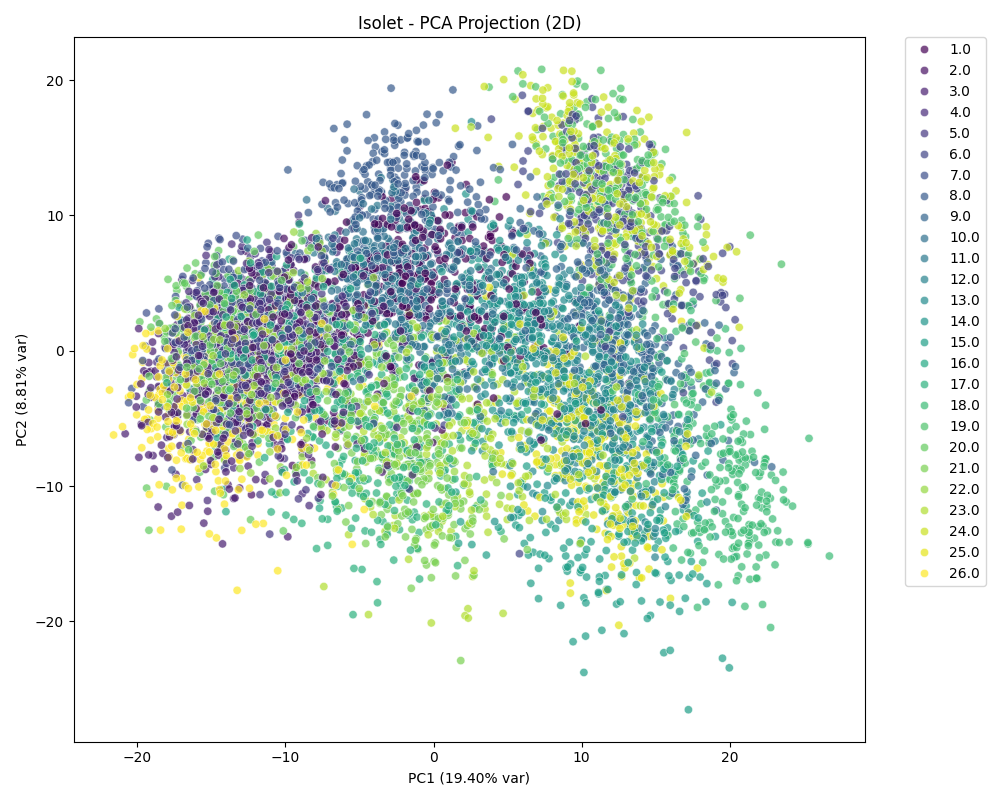 |

#### 1. Decision Tree (DT)
- **Accuracy**: 0.8160
- **Classification Error**: 0.1840
- **Weighted Precision**: 0.8180
- **Weighted Recall**: 0.8160
- **Weighted F1-Score**: 0.8157
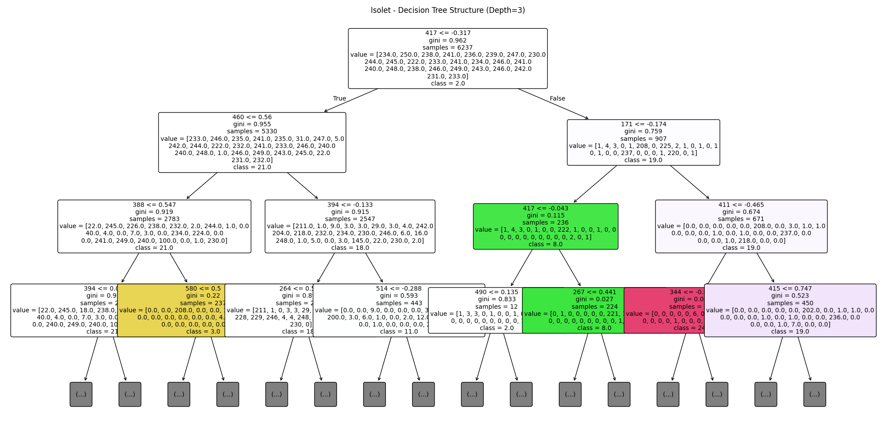
*Figure: First few layers of the Decision Tree.*

#### 2. Random Forest (RF)
- **K (Trees)**: 100
- **Accuracy**: 0.9436
- **Classification Error**: 0.0564
- **Weighted Precision**: 0.9451
- **Weighted Recall**: 0.9436
- **Weighted F1-Score**: 0.9438
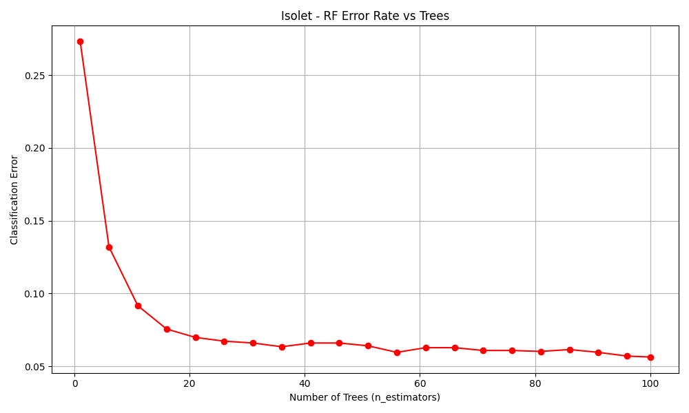
*Figure: Error rate decreases as number of trees increases.*

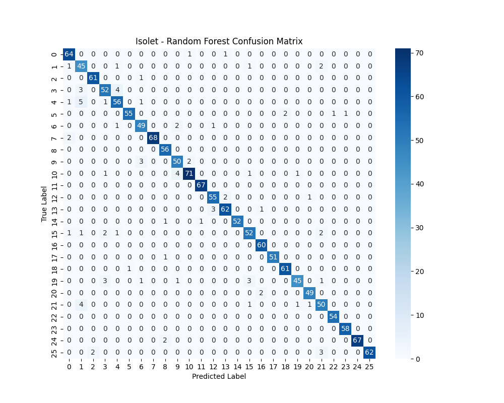

#### Top Features (Random Forest)
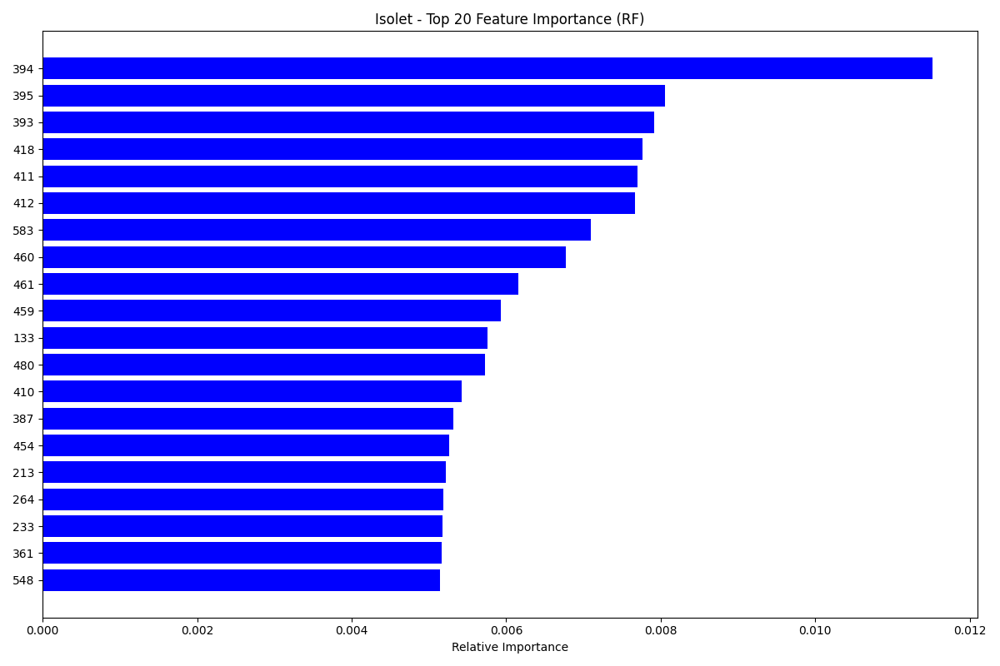

#### Comparison
- RF Improvement over DT: 12.76%
- Random Forest outperformed Decision Tree as expected, reducing the variance and overfitting often seen in single decision trees.
